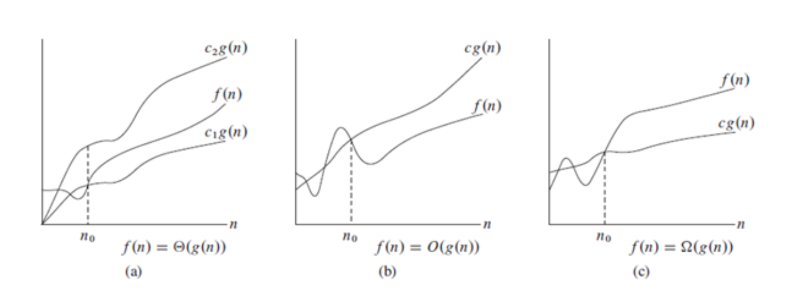
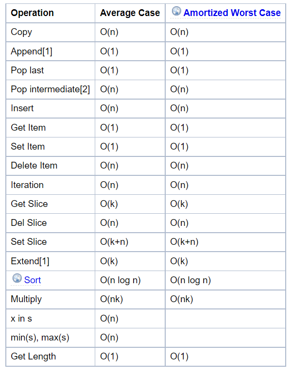
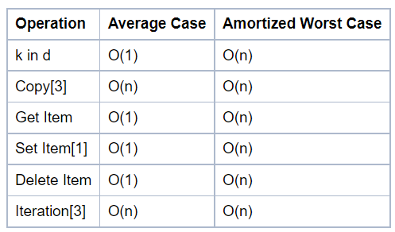
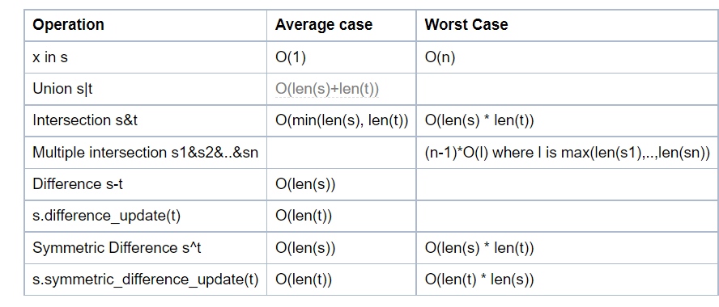

# PDSA - Week 2 Summary

[TOC]

## Complexity

The **complexity** of an algorithm is a function describing the efficiency of the algorithm in terms of the amount of input data. There are two main complexity measures of the efficiency of an algorithm:

**Space complexity**

The space complexity of an algorithm is the amount of memory it needs to run to completion.

Generally, space needed by an algorithm is the sum of the following two components:

* Fixed part($C$) - Size of code

* Variable Part($S_x$) - Depend on input size, to store in memory

    Total Space $(T(x)) = C + S_x$ 

**Time complexity**

The time complexity of an algorithm is the amount of computer time it needs to run to completion. Count the number of operations executed by the processor.

**Time complexity calculated in three types of cases:**

* Best case
* Average case
* Worst Case

**Growth rate of functions**

The number of operations for an algorithm is usually expressed as a function of the input. 

**For Example:**

```python
s = 0 #1
For i in range(n): #n+1
    for j in range(n): #n(n+1)
        s = s + 1 #n^2
print(s)#1
```

Function for given code is :

$f(n) = 2n^2 + 2n + 3$

Ignore all the constant and coefficient just look at the highest order term in relation to $n$. So $f(n)$ is proportional to $n^2$

**Notations to represent complexity**

* Big-Oh($O$) - Upper bound
* Omega($\Omega$) - Lower bound
* Theta($\Theta$) - Tightly bound



source = https://www.dotnetlovers.com/images/coolnikhilj2256c883d1-b9fc-46e9-b225-588ac5063c3d.png

**Calculate complexity**

```python
a = 10
b = 20
s = a + b
print(s)
```

**Complexity ?** O(1)

**Complexity for single loop**

```python
s = 0
For i in range(n):
	s = s + 1
```

**Complexity ?** O(n)

**Complexity for nested two loop**

```python
s = 0
For i in range(n):
    for j in range(n):
        s = s + 1
```

**Complexity ?** $O(n^2)$

**Complexity for nested three loop**

```python
s = 0
For i in range(n):
    for j in range(n):
        for k in range(n)
        	s = s + 1
```

**Complexity ?** $O(n^3)$

**Complexity for combination of all**

```python
s = 0
For i in range(n):
	s = s + 1
s = 0
For i in range(n):
    for j in range(n):
        s = s + 1
s = 0
For i in range(n):
    for j in range(n):
        for k in range(n)
        	s = s + 1
```

**Complexity ?** $O(n^3)$


**Complexity for recursive solution**

```python
def factorial(n)
	if (n == 0):
		return 1
	return n * factorial(n - 1)
```

Recurrence relation ? T(n) = T(n-1) + O(1)  = 1+1+1...n times

**Complexity ?** $O(n)$


**Complexity for recursive solution**

```python
def merge(A,B):
    #statement block for merging two sorted array
def mergesort(A):
    n = len(A)
    if n <= 1:
        return(A)
    L = mergesort(A[:n//2])
    R = mergesort(A[n//2:])
    B = merge(L,R)
    return(B) 
```

**Recurrence relation ?** T(n) = 2T(n/2)+ O(n)

**Complexity ?** $O(nlogn)$


## Searching Algorithm

### Linear search and Binary search working

https://www.cs.usfca.edu/~galles/visualization/Search.html

#### Implementation of Linear Search or Naïve Search

```python
def naivesearch(v,l):
  for x in l:
    if v == x:
      return(True)
  return(False)
```

#### Analysis

**Best Case** -    $O(1)$

**Average Case**  -  $O(n)$

**Worst Case** -  $O(n)$

#### Implementation of Binary Search

```python
def binarysearch(v,l):
  if l == []:
    return(False)

  m = len(l)//2

  if v == l[m]:
    return(True)

  if v < l[m]:
    return(binarysearch(v,l[:m]))
  else:
    return(binarysearch(v,l[m+1:]))
```

#### Analysis

**Best Case** -    $O(1)$

**Average Case**  -  $O(logn)$

**Worst Case** -  $O(logn)$


## Sorting Algorithm

### Selection Sort

#### Working

<figure class="video_container">
  <iframe src="https://visualgo.net/en/sorting" frameborder="0"  height="610px" allowfullscreen="true"> </iframe>
</figure>


Source - https://visualgo.net/en/sorting

#### Implementation

```python
def selectionsort(L):
    n = len(L)
    if n < 1:
        return(L)
    for i in range(n):
        mpos = i
        for j in range(i+1,n):
            if L[j] < L[mpos]:
                mpos = j
        (L[i],L[mpos]) = (L[mpos],L[i])
    return(L)
```

#### Analysis

**Best Case** -    $n + (n-1) + (n-2)...2 + 1 = n(n+1)/2 = O(n^2)$

**Average Case**  -  $n + (n-1) + (n-2)...2 + 1 = n(n+1)/2 = O(n^2)$

**Worst Case** -  $n + (n-1) + (n-2)...2 + 1 = n(n+1)/2 = O(n^2)$

**Stable** - No

**Sort in Place** - Yes


### Insertion Sort

#### Working

<figure class="video_container">
  <iframe src="https://visualgo.net/en/sorting" frameborder="0"  height="600px" allowfullscreen="true"> </iframe>
</figure>


Source - https://visualgo.net/en/sorting

#### Implementation

```python
def insertionsort(L):
    n = len(L)
    if n < 1:
        return(L)
    for i in range(n):
        j = i
        while(j > 0 and L[j] < L[j-1]):
            (L[j],L[j-1]) = (L[j-1],L[j])
            j = j-1
    return(L)
```

#### Analysis

**Best Case** -    $1 + 1 + 1...1 + 1(n times) = n = O(n)$

**Average Case**  -  $n + (n-1) + (n-2)...2 + 1 = n(n+1)/2 = O(n^2)$

**Worst Case** -  $n + (n-1) + (n-2)...2 + 1 = n(n+1)/2 = O(n^2)$

**Stable** - Yes

**Sort in Place** - Yes


### Merge Sort

#### Working

<figure class="video_container">
  <iframe src="https://visualgo.net/en/sorting" frameborder="0"  height="605px" allowfullscreen="true"> </iframe>
</figure>


Source - https://visualgo.net/en/sorting

#### Implementation

```python
def merge(A,B):
    (m,n) = (len(A),len(B))
    (C,i,j) = ([],0,0)
    while i < m and j < n:
        if A[i] <= B[j]:
            C.append(A[i])
            i += 1
        else:
            C.append(B[j])
            j += 1
    while i < m:
        C.append(A[i])
        i += 1
    while j < n:
        C.append(B[j])
        j += 1
    return C

    
def mergesort(A):
    n = len(A)
    if n <= 1:
        return(A)
    L = mergesort(A[:n//2])
    R = mergesort(A[n//2:])
    B = merge(L,R)
    return(B)
```

#### Analysis

**Best Case** -    $n + n + n...logn~times = nlogn = O(nlogn)$

**Average Case**  - $n + n + n...logn~times = nlogn = O(nlogn)$

**Worst Case** - $n + n + n...logn~times = nlogn = O(nlogn)$

**Stable** - Yes

**Sort in Place** - No


### Complexity of python data structure's method

**Keep in mind before using for efficiency.**

https://wiki.python.org/moin/TimeComplexity

**List methods**



**Dictionary methods**



**Set Methods**



