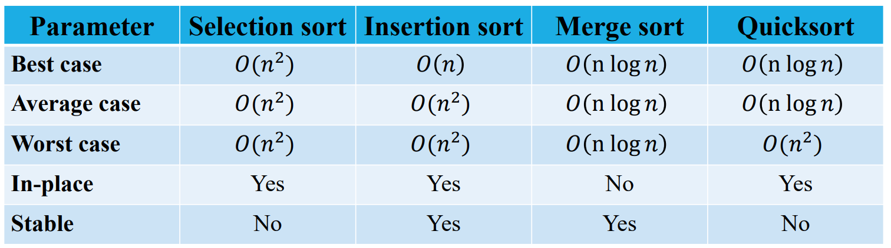
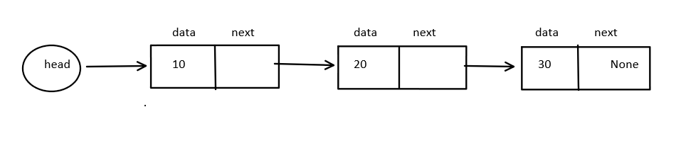
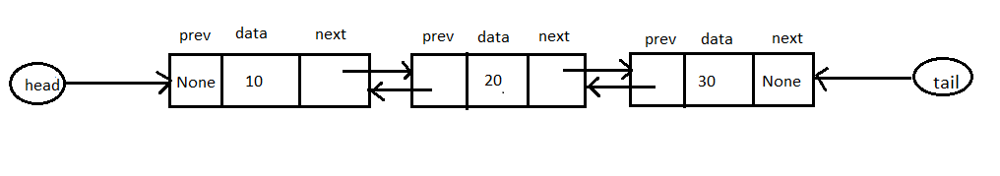
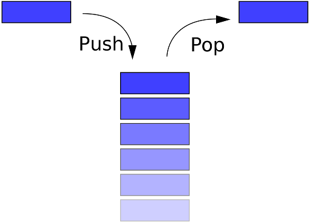
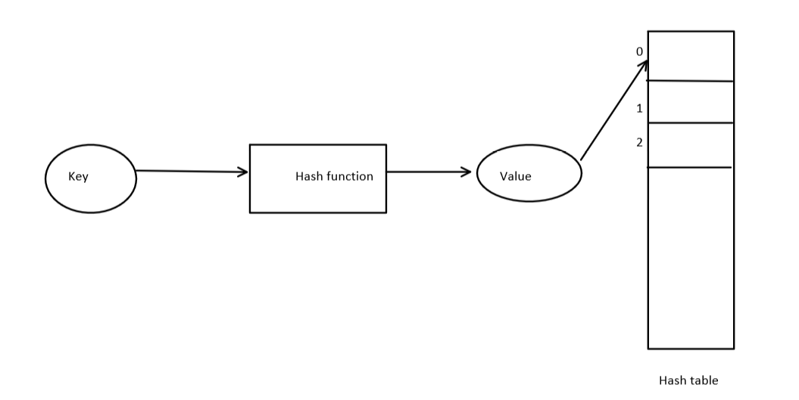
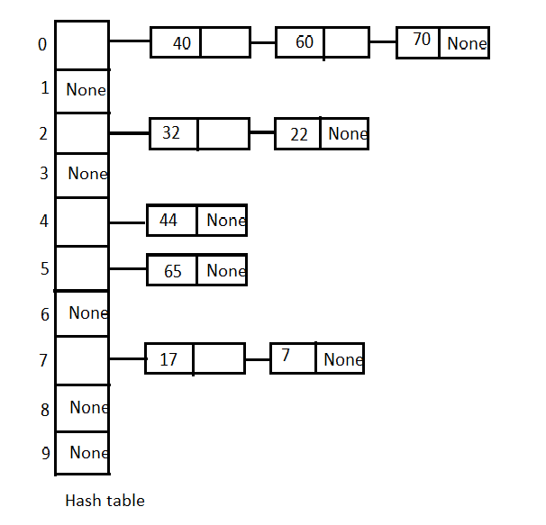

# Week-3  Summary

[TOC]

## Quick Sort

**Visualization**

<figure class="video_container">
  <iframe src="https://visualgo.net/en/sorting" frameborder="0"  height="610px" allowfullscreen="true"> </iframe>
</figure>


Source - https://visualgo.net/en/sorting

### Implementation

```python
def quicksort(L,l,r): # Sort L[l:r]
    if (r - l <= 1):
        return L
    (pivot,lower,upper) = (L[l],l+1,l+1)
    for i in range(l+1,r):
        if L[i] > pivot: # Extend upper segment
            upper = upper+1
        else: # Exchange L[i] with start of upper segment
            (L[i], L[lower]) = (L[lower], L[i])
			# Shift both segments
            (lower,upper) = (lower+1,upper+1)
	# Move pivot between lower and upper
    (L[l],L[lower-1]) = (L[lower-1],L[l])
    lower = lower-1
	# Recursive calls
    quicksort(L,l,lower)
    quicksort(L,lower+1,upper)
    return(L)
```

**Other Implementation**

```python
def partition(L,lower,upper):
  # we are selecting first element as a pivot 
  pivot = L[lower]
  i = lower
  for j in range(lower+1,upper+1):
    if L[j] <= pivot:
      i += 1
      L[i],L[j] = L[j],L[i]
  L[lower],L[i]= L[i],L[lower]
  #returning the position of pivot
  return i

def quicksort(L,lower,upper):
  if(lower < upper):
    pivot_pos = partition(L,lower,upper);
    # calling the quick sort on leftside part of pivot
    quicksort(L,lower,pivot_pos-1)
    # calling the quick sort on rightside part of pivot
    quicksort(L,pivot_pos+1,upper)
  return L
```


**Recurrence relation in best and average case**   T(n) = 2T(n/2)+ O(n)

**Recurrence relation in worst case** T(n) = T(n-1)+ O(n)

### Analysis

**Best Case** -    $n + n + n...logn~times = nlogn = O(nlogn)$

**Average Case**  - $n + n + n...logn~times = nlogn = O(nlogn)$

**Worst Case** - $n + (n-1) + (n-2)...1 = n(n+1)/2 = O(n^2)$

**Stable** - No

**Sort in Place** - Yes


## Comparison of sorting algorithm

)


## Linked List

The linked list is a collection of elements, where each element points to the next. It is a data structure consisting of a collection of nodes that together represent a sequence.

There are two types of linked lists:

* Singly linked list
* Doubly linked list

**Singly linked list**

* `head`:- Store the reference of the first node. If the list is empty, then it stores `None`
* Each node have two fields:
    * `data` :- Store actual value
    * `next`:- Store reference of the next node

**Representation**



**Doubly linked list**

* `head`:- Store the reference of the first node. If the list is empty, then it stores `None`
* `tail`:- Store the reference of the last node. If the list is empty, then it stores `None`

* Each node have three fields:
    * `prev`:- store reference of the previous node
    * `data` :- Store actual value
    * `next`:- Store reference of the next node

**Representation**



**Implementation of singly linked list in Python**

* **Using one class- Recursively**

    ```python
    class Node:
        def __init__(self, v = None):
            self.value = v
            self.next = None
            return
        def isempty(self):
            if self.value == None:
                return(True)
            else:
                return(False)
        #recursive
        def append(self,v):
            if self.isempty():
                self.value = v
            elif self.next == None:
                self.next = Node(v)
            else:
                self.next.append(v)
            return
        # append, iterative
        def appendi(self,v):
            if self.isempty():
                self.value = v
                return
            temp = self
            while temp.next != None:
                temp = temp.next
            temp.next = Node(v)
            return
        def insert(self,v):
            if self.isempty():
                self.value = v
                return
            newnode = Node(v)
            # Exchange values in self and newnode
            (self.value, newnode.value) = (newnode.value, self.value)
            # Switch links
            (self.next, newnode.next) =(newnode, self.next)
            return
        # delete, recursive
        def delete(self,v):
            if self.isempty():
                return
            if self.value == v:
                self.value = None
                if self.next != None:
                    self.value = self.next.value
                    self.next = self.next.next
                return
            else:
                if self.next != None:
                    self.next.delete(v)
                    if self.next.value == None:
                        self.next = None
            return
        def display(self):
            if self.isempty()==True:
                print('None')
            else:
                temp = self
                while temp!=None:
                    print(temp.data,end="  ")
                    temp = temp.next
    head = Node(10)
    head.append(20)
    head.append(30)
    head.appendi(40)
    head.appendi(50)
    head.delete(30)
    head.display()
    ```

* **Using two classes**

    ```python
    class Node:
        def __init__(self, data):
            self.data = data
            self.next = None
    class LinkedList:
        def __init__(self):
            self.head = None
        def isempty(self):
            if self.head == None:
                return True
            else:
                return False
        def append(self,data):
            # If list is empty
            if self.isempty():
                self.head=Node(data)
            else:
                temp = self.head
                while temp.next != None:
                    temp = temp.next
                temp.next = Node(data)
        def delete(self,v):
            # If list is empty
            if self.isempty()==True:
                return 'List is empty'
            # if list have only one element and equal to v
            elif self.head.next==None:
                if self.head.data==v:
                    self.head = None
                else:
                    return 'Not exist'
            else:
                temp = self.head
                temp1 = self.head
                while temp.next!= None and temp.data != v:
                    temp1 = temp
                    temp = temp.next
                if temp.data==v and temp==self.head:
                    self.head = temp.next
                elif temp.data==v:
                    temp1.next= temp.next
                else:
                    return 'Not exist'
        def display(self):
            if self.isempty()==True:
                print('None')
            else:
                temp = self.head
                while temp!=None:
                    print(temp.data,end="  ")
                    temp = temp.next
    L = LinkedList()
    L.append(30)
    L.append(40)
    L.append(50)
    L.delete(30)
    L.display()
    ```

**Advantage**

* Insertion and deletion operations are easy
* many complex applications can be easily carried out with linked list concepts like tree, graph, etc.

**Disadvantage**

* More memory required to store data
* Random access is not possible

**Application**

* Implementation stack, queue, deque
* Representation of graph.
* Representation of sparse matrix
* Manipulation of the polynomial expression

**Visualization of Linked List**

<figure class="video_container">
  <iframe src="https://visualgo.net/en/list" frameborder="0"  height="610px" allowfullscreen="true"> </iframe>
</figure>
Source - https://visualgo.net/en/list


## Stack

A Stack is a non-primitive linear data structure. It is an ordered list in which the addition of a new data item and deletion of an already existing data item can be done from only one end, known as `top` of the stack.

The last added element will be the first to be removed from the Stack. That is the reason why stack is also called Last In First Out (LIFO) type of data structure.




### Basic operations on Stack

**Push**

The process of adding a new element to the top of the Stack is called the `Push` operation. 

**Pop**

The process of deleting an existing element from the top of the Stack is called the `Pop` operation. It returns the deleted value.

**Traverse/Display**

The process of accessing or reading each element from top to bottom in Stack is called the `Traverse` operation.

### Applications of Stack

* Reverse the string
* Evaluate Expression
* Undo/Redo Operation
* Backtracking
* Depth First Search(DFS) in Graph(Will be discussed in Week-4)

### Implementation of Stack in Python

* Using a list
* Using a Linked list 


## Queue

The Queue is a non-primitive linear data structure. It is an ordered collection of elements in which new elements are added at one end called the `Back` end, and the existing element is deleted from the other end called the `Front` end.

A Queue is logically called a First In First Out (FIFO) type of data structure.


### Basic operations on Queue

**Enqueue**

The process of adding a new element at the `Back` end of Queue is called the `Enqueue` operation. 

**Dequeue**

The process of deleting an existing element from the `Front` of the Queue is called the `Dequeue` operation. It returns the deleted value.

**Traverse/Display**

The process of accessing or reading each element from `Front` to `Back` of the Queue is called the `Traverse` operation.

### Applications of Queue

* Spooling in printers
* Job Scheduling in OS
* Waiting list application
* Breadth First Search(BFS) in Graph(Will be discussed in Week-4)

### Implementation of the Queue in python

* Using a list
* Using a Linked list 

**Visualization of Stack and Queue**

<figure class="video_container">
  <iframe src="https://visualgo.net/en/list" frameborder="0"  height="610px" allowfullscreen="true"> </iframe>
</figure>
Source - https://visualgo.net/en/list


## Hashing

Hashing is a technique or process of mapping keys, values into the hash table by using a hash function.

**For storing element**



**For searching element**


**Collision:**

The situation where a newly inserted key maps to an already occupied slot in the hash table is called **collision**.

**Collision resolving technique**

* **Open addressing(Close hashing)**

    * **Linear probing** is an open addressing scheme in computer programming for resolving hash collisions in hash tables. Linear probing operates by taking the original hash index and adding successive values linearly until a free slot is found.

        An example sequence of linear probing is:

        `h(k)+0, h(k)+1, h(k)+2, h(k)+3 .... h(k)+m-1`

        where `m` is a size of hash table, and `h(k)` is the hash function.

        **Hash function**

        Let `h(k) = k mod m` be a hash function that maps an element `k` to an integer in [0, *m*−1], where *m* is the size of the table. Let the  `i`<sup>th</sup> probe position for a value `k` be given by the function

        `h'(k,i) = (h(k) + i) mod m` 

        The value of `i = 0, 1, . . ., m – 1`. So we start from `i = 0`, and increase this until we get a free block in hash table.

        

    * **Quadratic probing** is an open addressing scheme in computer programming for resolving hash collisions in hash tables. Quadratic probing operates by taking the original hash index and adding successive values of an arbitrary quadratic polynomial until an open or empty slot is found.

        An example of a sequence using quadratic probing is:

        $h, h+1, h+4, h+9...h+i^2$

        **Quadratic function**

        Let `h(k) = k mod m` be a hash function that maps an element `k` to an integer in [0, *m*−1], where *m* is the size of the table. Let the  $i^{th}$ probe position for a value *k* be given by the function

        $h(k,i)= (h(k)+c_1i+c_2i^2)~mod~m$

        where `c1 and c2` are positive integers. The value of `i = 0, 1, . . ., m – 1`. So we start from `i = 0`, and increase this until we get one free slot in hash table.

        

* **Closed addressing ( Open hashing)**

    * **Separate chaining using linked list**: Maintain the separate linked list for each possible generated index by the hash function.

        For example, if the hash function is `k mod 10` where k is the key and 10 is the size of the hash table.

    

    
    
    
